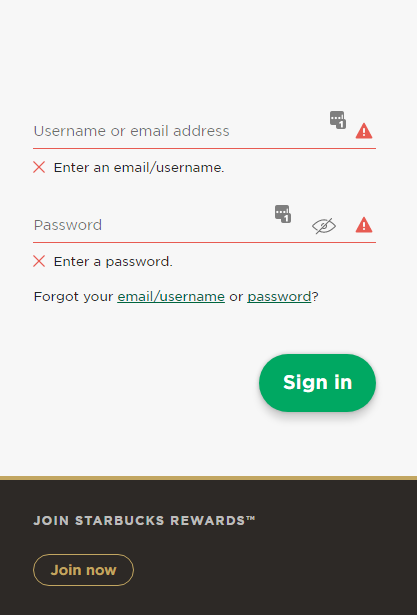

# Sign-in pages

## Amazon Sign-in Page
- Clean and uncluttered
- Allows email or phone for sign-in
- Account creation option is directly visible
- No scrolling to see other options, etc.
- This is an entirely separate webpage

## Starbuck Sign-in Page
- Clean and uncluttered
- Allows for email or username sign-in
- Can click on eye to view password (a nice optional functionality)
- Doesn't make the best use of space
  - This is an entirely separate webpage
  - This could be a pop-out of sorts in *our* web app, overlain across the main content

# Tracking pages

## UF Health Insurance Waiver Tracking
- Shows major steps for each submitted waiver
- Shows timeframe of waiver validity
- Can see waivers from previous years
- Link to submit a new waiver

## USPS Package Tracking
- Shows major steps and current status
- Tracking number is clearly visible
  - If person needs to call in for more info, they have it right there
- A detailed view of tracking steps is listed below in table format
- Email/text subscription for update types (probably not in our app, lol)
- Condensable/expandable views (via the "See Less/More" buttons)
- Downside is that it's a bit cluttered and has a lot of info
  - Perhaps combine this implementation with previous one for multiple tracking views

